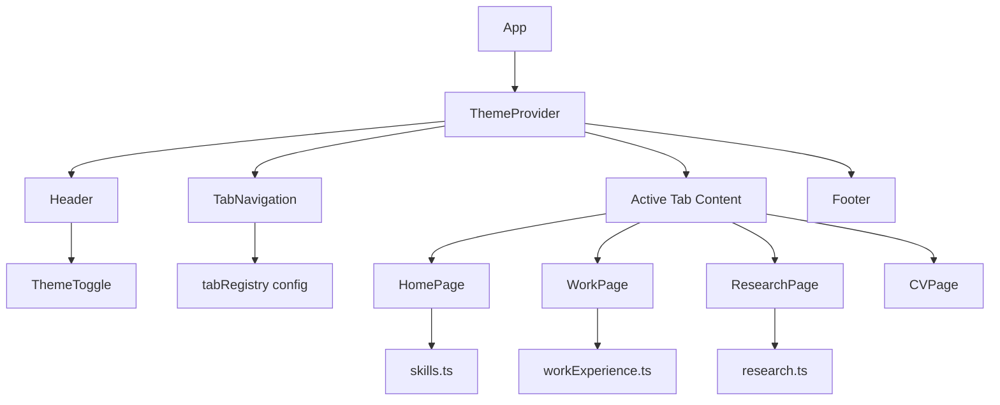

# Design Document

## Overview

A single-page React application (SPA) built with TypeScript and Vite. The site uses a tab-based navigation pattern where each tab maps to a content component. Styling is handled via Tailwind CSS with built-in dark mode support. No backend — all content is static data defined in TypeScript files.

**Tech Stack:**
- React 18 + TypeScript
- Vite (build tool)
- Tailwind CSS
- react-router-dom (routing)
- react-icons (social link icons)
- GitHub Pages (hosting)
- GitHub Actions (CI/CD)

**Key Design Decisions:**
- React Router (react-router-dom) — each tab maps to a URL route (e.g., `/`, `/work`, `/research`, `/cv`). This enables direct linking to specific tabs, browser back/forward navigation, and shareable URLs. Uses `HashRouter` for GitHub Pages compatibility (avoids 404s on page refresh).
- Tailwind CSS — utility-first approach is faster to build with, built-in dark mode support via `dark:` prefix eliminates manual theming plumbing, and no separate CSS files are needed per component.
- Static data files — all content (work experience, skills, research) lives in TypeScript data files, making updates trivial without touching component code.
- PDF served from `/public` — the CV PDF is a static asset, no generation needed.
- GitHub Pages — free static hosting, auto-deploys via GitHub Actions on push to `main`. Repo is named `mbsuraj.github.io` so the site is served at the root URL with no base path needed.

## Architecture



**Data flow:** `App` wraps content in `HashRouter`. `TabNavigation` renders `NavLink` components from the tab registry. Routes render the corresponding page component. `ThemeProvider` manages dark/light state via React context and toggles a `dark` class on `<html>` (Tailwind's `class` strategy).

## Components and Interfaces

### Tab Registry

```typescript
// src/data/tabRegistry.ts
interface TabEntry {
  path: string;      // e.g., "/", "/work", "/research", "/cv"
  label: string;
  component: React.ComponentType;
}

const tabRegistry: TabEntry[] = [
  { path: "/", label: "Home", component: HomePage },
  { path: "/work", label: "Work Experience", component: WorkPage },
  { path: "/research", label: "Research", component: ResearchPage },
  { path: "/cv", label: "CV", component: CVPage },
];
```

Adding/removing a tab = adding/removing an entry from this array. No navigation component changes needed.

### ThemeProvider

```typescript
// src/context/ThemeContext.tsx
interface ThemeContextValue {
  theme: "dark" | "light";
  toggleTheme: () => void;
}
```

Adds or removes the `dark` class on `document.documentElement`. Components use Tailwind's `dark:` variant to style dark mode (e.g., `bg-white dark:bg-gray-900`).

### Core Components

| Component | Props | Responsibility |
|-----------|-------|----------------|
| `App` | — | Wraps layout in `HashRouter`, renders routes from tab registry |
| `TabNavigation` | `tabs: TabEntry[]` | Renders `NavLink` components, active state from URL matching |
| `ThemeToggle` | — | Consumes ThemeContext, renders toggle button |
| `Footer` | — | Renders social icon links (LinkedIn, GitHub, email) |
| `HomePage` | — | Creative landing with name, title, summary, skills |
| `WorkPage` | — | Maps over `workExperience` data, renders entries |
| `ResearchPage` | — | Renders packages + education sections |
| `CVPage` | — | Renders resume content + PDF download button |


## Data Models

### Work Experience

```typescript
// src/data/workExperience.ts
interface WorkEntry {
  company: string;
  title: string;
  dateRange: string;
  accomplishments: string[];
}

const workExperience: WorkEntry[] = [
  {
    company: "Amazon Inc.",
    title: "Data Scientist II",
    dateRange: "2023 – Present",
    accomplishments: [/* ... */],
  },
  {
    company: "Circle K",
    title: "Senior Data Scientist",
    dateRange: "2022 – 2023",
    accomplishments: [/* ... */],
  },
  {
    company: "Circle K",
    title: "Data Scientist",
    dateRange: "2021 – 2022",
    accomplishments: [/* ... */],
  },
  {
    company: "ProviderTrust",
    title: "ETL Specialist",
    dateRange: "2020 – 2021",
    accomplishments: [/* ... */],
  },
  {
    company: "Cairn Oil and Gas",
    title: "Engineer",
    dateRange: "2015 – 2018",
    accomplishments: [/* ... */],
  },
];
```

### Research Data

```typescript
// src/data/research.ts
interface PythonPackage {
  name: string;
  fullName: string;
  description: string;
  url?: string;
}

interface Education {
  degree: string;
  institution: string;
  field: string;
}

const packages: PythonPackage[] = [
  { name: "MIC", fullName: "Make-it-Certain", description: "...", url: "..." },
  { name: "StationarityToolkit", fullName: "StationarityToolkit", description: "...", url: "..." },
];

const education: Education[] = [
  { degree: "M.S.", institution: "Arizona State University", field: "Business Analytics" },
  { degree: "B.Tech", institution: "IIT India", field: "Petroleum Engineering with Finance" },
];
```

### Skills Data

```typescript
// src/data/skills.ts
const skills: string[] = [
  "Probabilistic Forecasting",
  "Scalable ML Systems",
  "Infrastructure Engineering",
  // ...
];
```

### Theme

Tailwind's `class` dark mode strategy is used. The `ThemeProvider` toggles a `dark` class on `<html>`. Components apply dark styles via the `dark:` prefix:

```tsx
// Example usage in components
<div className="bg-white dark:bg-gray-900 text-gray-900 dark:text-gray-100">
```

The `tailwind.config.ts` at the project root sets `darkMode: "class"` and extends the theme with the project's accent color (`#64ffda` for dark, `#0077b6` for light — handled via conditional classes or CSS variables if needed).

### File Structure

```
.github/
└── workflows/
    └── deploy.yml
tailwind.config.ts
src/
├── App.tsx
├── main.tsx
├── context/
│   └── ThemeContext.tsx
├── components/
│   ├── TabNavigation.tsx
│   ├── ThemeToggle.tsx
│   └── Footer.tsx
├── pages/
│   ├── HomePage.tsx
│   ├── WorkPage.tsx
│   ├── ResearchPage.tsx
│   └── CVPage.tsx
├── data/
│   ├── tabRegistry.ts
│   ├── workExperience.ts
│   ├── research.ts
│   └── skills.ts
└── styles/
    └── global.css
public/
└── resume.pdf
```

`src/styles/global.css` contains the Tailwind directives:

```css
@tailwind base;
@tailwind components;
@tailwind utilities;
```

## Deployment

**Hosting:** GitHub Pages user site at `https://mbsuraj.github.io`

Since the repo is named `mbsuraj.github.io`, this is a GitHub Pages user site — the site is served at the root domain with no subpath. Vite's default `base: "/"` requires no change.

**GitHub Actions Workflow:** `.github/workflows/deploy.yml`

```yaml
name: Deploy to GitHub Pages

on:
  push:
    branches: [main]

permissions:
  contents: read
  pages: write
  id-token: write

concurrency:
  group: pages
  cancel-in-progress: true

jobs:
  build-and-deploy:
    runs-on: ubuntu-latest
    environment:
      name: github-pages
      url: ${{ steps.deployment.outputs.page_url }}
    steps:
      - uses: actions/checkout@v4

      - uses: actions/setup-node@v4
        with:
          node-version: 20
          cache: npm

      - run: npm ci
      - run: npm run build

      - uses: actions/upload-pages-artifact@v3
        with:
          path: dist

      - id: deployment
        uses: actions/deploy-pages@v4
```

The workflow triggers on every push to `main`, builds the Vite project, and deploys the `dist/` output to GitHub Pages using the official `actions/deploy-pages` action.

## Correctness Properties

*A property is a characteristic or behavior that should hold true across all valid executions of a system — essentially, a formal statement about what the system should do. Properties serve as the bridge between human-readable specifications and machine-verifiable correctness guarantees.*

### Property 1: Tab registry drives rendered tab count

*For any* tab registry array of length N, the TabNavigation component should render exactly N tab buttons, each with the correct label from the registry.

**Validates: Requirements 1.1, 1.4**

### Property 2: Tab click navigates to correct route

*For any* tab registry and any tab entry within it, clicking that tab's NavLink should navigate the browser to the entry's `path`, and the corresponding page component should be rendered.

**Validates: Requirements 1.2**

### Property 3: Data rendering completeness

*For any* work experience entry with company, title, dateRange, and accomplishments fields, the rendered WorkPage entry should contain all of those field values in its output.

**Validates: Requirements 3.2**

### Property 4: Work entries display in reverse chronological order

*For any* set of work experience entries with date ranges, the WorkPage should render them such that each entry's start year is greater than or equal to the next entry's start year.

**Validates: Requirements 3.1**

### Property 5: Theme toggle round-trip

*For any* initial theme state (dark or light), toggling the theme twice should restore the original theme state.

**Validates: Requirements 6.2**

### Property 6: Footer persists across all tabs

*For any* tab in the tab registry, when that tab is active, the Footer component should remain visible in the rendered output.

**Validates: Requirements 7.1**

## Error Handling

| Scenario | Handling |
|----------|----------|
| Empty tab registry | Render empty nav bar, show fallback message in content area |
| Missing PDF file | Download button shows disabled state or error toast |
| Invalid theme value in state | Default to dark mode |
| Missing data fields (e.g., empty accomplishments) | Render entry without the empty section, no crash |
| Social link URL missing | Omit that icon from footer |

No backend or API calls — error handling is limited to defensive rendering of potentially incomplete data.

## Testing Strategy

**Testing Library:** Vitest + React Testing Library

**Unit Tests (example-based):**
- Home page renders name, title, and summary (Req 2.1, 2.2)
- Default active tab is Home on load (Req 1.3)
- All 5 work experience companies are present (Req 3.3)
- Research page shows MIC and StationarityToolkit (Req 4.1)
- Education credentials displayed (Req 4.2)
- CV page has download button with correct PDF href (Req 5.2)
- Theme defaults to dark mode (Req 6.3)
- Footer has LinkedIn, GitHub, email links with `target="_blank"` (Req 7.2, 7.3)

**Property Tests (fast-check):**
- Library: [fast-check](https://github.com/dubzzz/fast-check) with Vitest
- Minimum 100 iterations per property
- Each test tagged with: `Feature: personal-website, Property {N}: {title}`
- Properties 1–6 as defined in Correctness Properties section above

**What is NOT property tested (and why):**
- Static content presence (Req 2.1, 3.3, 4.1, 4.2) — these are fixed data checks, not input-varying behavior
- Visual/aesthetic requirements (Req 2.4) — not computationally testable
- Browser download behavior (Req 5.3) — browser-native feature
- No-reload theme switch (Req 6.4) — architectural constraint, verified by implementation approach
